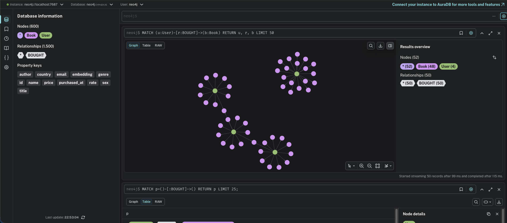

# 📚 Lectio Recommender

A book recommendation system built with **TensorFlow**, **Neo4j**, and **FastAPI**. It learns user preferences from purchase history and recommends books based on embedding similarity.

---

## 🧠 How it works

The system uses a **two-tower model** — two independent neural networks that learn to represent users and books as vectors (embeddings) in the same semantic space. Users and books that have interacted are pushed closer together in this space; those that have never interacted are pushed apart.

```
User Tower                Book Tower
   user_id ──►  Embedding ──► Dense ──► vector [64d]
   book_id ──►  Embedding ──► Dense ──► vector [64d]
                                  │
                             Dot Product
                                  │
                            Score [0, 1]
```

After training, the vectors are stored in **Neo4j** as node properties. Real-time recommendations use Neo4j's native vector index (HNSW) to find the closest books to a given user in milliseconds.

---

## 🏗️ Architecture

```
Client
  │
  ▼
API Gateway (FastAPI)
  │
  ├── PostgreSQL  ──  users, books, purchases
  │
  └── Neo4j       ──  (:User)-[:BOUGHT]->(:Book)
                       embeddings + vector index
```

### Graph visualization



**Training pipeline** (runs offline):

```
PostgreSQL ──► Workers 1/2/3 (parallel) ──► TensorFlow Two-Tower
                                                      │
                                          user_embeddings.npy
                                          book_embeddings.npy
                                                      │
                                              Worker 4 (embedding_saver)
                                                      │
                                                   Neo4j
```

---

## 🚀 Running the project

### Prerequisites

- Docker and Docker Compose
- Python 3.11+
- Poetry

### 1. Clone and configure

```bash
git clone https://github.com/your-username/lectio-recommender.git
cd lectio-recommender
cp .env.example .env
# fill in your credentials in .env
```

### 2. Start the databases

```bash
docker compose up db neo4j -d
```

### 3. Seed the database

```bash
poetry install
poetry run python3 seed.py
```

### 4. Train the model and save embeddings to Neo4j

```bash
# Train the TensorFlow model and generate embeddings
docker compose --profile training up trainer

# Save embeddings to Neo4j
docker compose --profile training up embedding_saver
```

### 5. Start the API

```bash
poetry run uvicorn app.main:app --reload
```

Access the interactive docs at: `http://localhost:8000/docs`

---

## 📡 Endpoints

| Method | Route | Description |
|--------|-------|-------------|
| `POST` | `/users/` | Create a user |
| `GET` | `/users/{id}` | Get a user |
| `POST` | `/books/` | Create a book |
| `POST` | `/purchases/` | Register a purchase |
| `GET` | `/recommendations/{user_id}` | Get book recommendations |

### Sample response — recommendations

```json
{
  "user_id": 42,
  "total": 10,
  "books": [
    {
      "id": 137,
      "title": "Dune",
      "author": "Frank Herbert",
      "genre": "Science Fiction",
      "price": 49.90,
      "rate": 4.8,
      "score": 0.9423
    }
  ]
}
```

---

## 🗂️ Project structure

```
lectio-recommender/
├── app/
│   ├── main.py                   # FastAPI app
│   ├── schemas.py                # Pydantic schemas
│   ├── crud.py                   # Database operations
│   ├── database.py               # PostgreSQL connection
│   ├── neo4j_connection.py       # Neo4j connection
│   └── routers/
│       └── recommendations.py    # Recommendation endpoint
├── trainer/
│   ├── train.py                  # TensorFlow two-tower model
│   └── Dockerfile
├── embedding_saver/
│   ├── worker4.py                # Saves embeddings to Neo4j
│   └── Dockerfile
├── seed.py                       # Fake data generation
├── embeddings/                   # Generated after training (gitignored)
├── docker-compose.yml
├── Dockerfile
├── pyproject.toml
├── .env.example
└── README.md
```

---

## 🛠️ Stack

| Layer | Technology |
|-------|-----------|
| API | FastAPI + Uvicorn |
| ORM | SQLAlchemy 2.0 |
| Relational database | PostgreSQL 16 |
| Graph database | Neo4j 5 |
| Machine Learning | TensorFlow 2.16 |
| Validation | Pydantic v2 |
| Containerization | Docker + Docker Compose |
| Dependency management | Poetry |

---

## 🔮 Future improvements

This project implements the architectural patterns used in production recommendation systems, but deliberately simplifies some operational aspects. Here's what would be needed to take it further:

**Cold start**
The current approach uses a proxy user with a similar profile (same country and gender) to generate recommendations for new users. A more robust solution would combine content-based filtering (recommending popular books in genres the user selected at signup), a dedicated model trained specifically for new users, and a gradual transition to collaborative filtering as purchase history grows.

**Incremental retraining**
Today the model is retrained from scratch every time. In production, new purchases arrive continuously and retraining from scratch daily or weekly is expensive. The next step would be implementing incremental learning — updating only the embedding weights affected by new interactions rather than retraining the full model.

**Online learning**
For systems with high user activity, embeddings can be updated in near real-time using techniques like streaming matrix factorization or lightweight online gradient updates. This ensures recommendations reflect very recent behavior without waiting for a full retraining cycle.

**Hard negative mining**
The current training uses random negative sampling — books the user never bought are selected at random. Production systems use hard negatives: books the model almost recommends but shouldn't (high similarity score, no purchase). This significantly improves embedding quality and pushes the model to learn more subtle distinctions between relevant and irrelevant items.

**Model quality monitoring**
There is currently no measurement of whether the model is performing well or degrading over time. A production setup would track offline metrics (Precision@K, Recall@K, NDCG) on a held-out test set after every retraining cycle, and online metrics (click-through rate, conversion) via A/B testing between model versions.

**Recommendation caching**
Every request hits Neo4j directly. For users with stable purchase histories, embeddings change only after retraining — so recommendations can be cached in Redis with a TTL aligned to the retraining frequency, reducing latency and database load significantly.

**Feature engineering**
The current model uses only user and book IDs as input. Including additional features — book genre, publication year, price range, user country, and age group — would substantially improve recommendation quality, especially for users with limited purchase history.

**Scheduled retraining pipeline**
The training job is currently triggered manually. The natural next step is an orchestrated pipeline (Airflow or Prefect) that monitors the volume of new purchases, triggers retraining automatically when a threshold is reached, evaluates the new model against the current one, and promotes it only if quality metrics improve.

---

## 📄 License

MIT